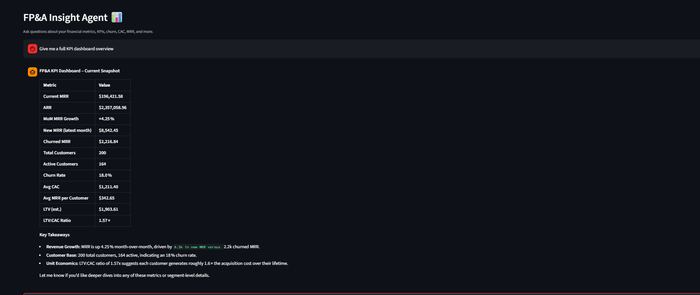
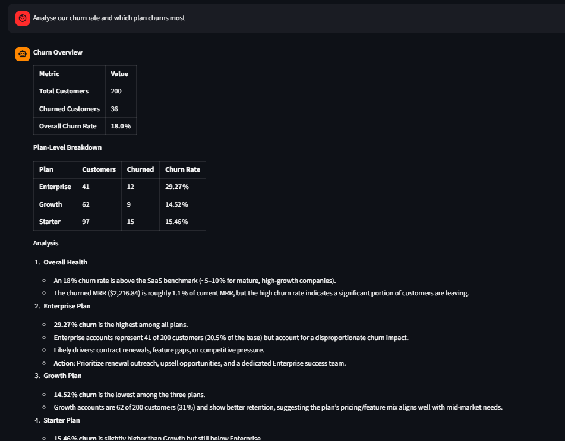
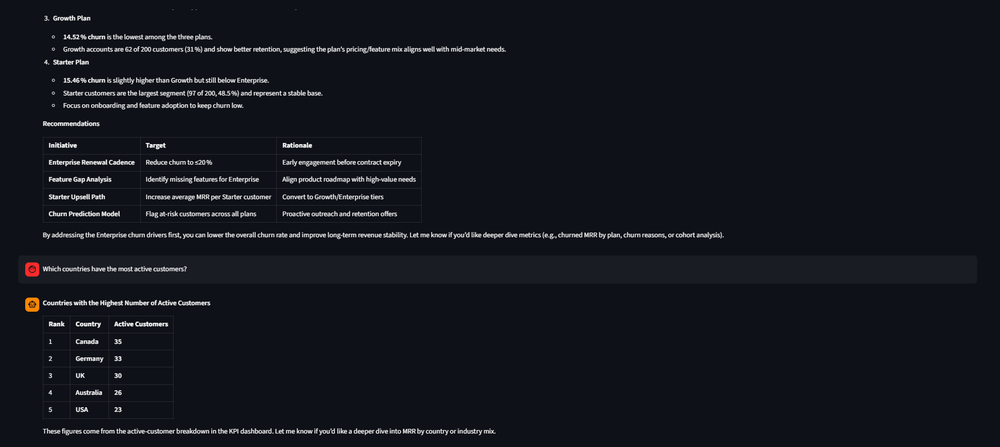

# FP&A Insight Agent 📊

An agentic AI assistant for financial planning & analysis — built with LangChain, LangGraph, FAISS, FastAPI, and Streamlit.

Ask natural language questions about your business metrics and get accurate, data-driven answers with multi-turn memory.

## Screenshots

### KPI Dashboard


### Churn Analysis


### Active Customers


## Architecture

```
fpna_agent/
├── data/
│   ├── generate_data.py   # Run once to generate synthetic CSVs
│   ├── mrr.csv            # Monthly revenue data
│   ├── customers.csv      # Customer & subscription data
│   ├── cac.csv            # Marketing spend & CAC
│   └── kpi_summary.csv    # Pre-computed KPI snapshot
├── backend/
│   ├── main.py            # FastAPI app (REST endpoints)
│   ├── agent.py           # LangGraph agent (memory + tool-calling)
│   ├── rag_engine.py      # FAISS index + semantic retrieval
│   └── kpi_tools.py       # LangChain tools (MRR, churn, CAC, etc.)
├── frontend/
│   └── app.py             # Streamlit UI
├── requirements.txt
└── .env.example
```

## Agent Flow

```
User Query
    ↓
RAG Retrieval (FAISS + Sentence Transformers)
    ↓
LLM (Groq - GPT-OSS-20B) with context + conversation memory
    ↓
Tool call needed? ──Yes──→ KPI Tool → back to LLM
         ↓ No
    Final Answer → Streamlit UI
```

## Features

- **Natural language queries** over structured FP&A data
- **5 KPI tools**: MRR/ARR trends, churn analysis, CAC & LTV, full dashboard, customer segments
- **Multi-turn memory** — ask follow-up questions, it remembers context
- **RAG over CSVs** — FAISS vector search + Sentence Transformers
- **FastAPI backend** — clean REST API with `/chat`, `/clear`, `/kpis`, `/health`
- **Streamlit frontend** — interactive UI with sidebar KPI snapshot and suggested queries
- **Swap-ready data** — replace CSVs with real data, same column names, works instantly

## Setup

```bash
# 1. Clone the repo
git clone https://github.com/Khushi0604/FpaInsightAgent.git
cd FpaInsightAgent

# 2. Install dependencies
pip install -r requirements.txt

# 3. Add your Groq API key (free at console.groq.com)
copy .env.example .env
# Open .env and paste your GROQ_API_KEY

# 4. Generate synthetic FP&A data
python data/generate_data.py

# 5. Terminal 1 — start FastAPI backend
uvicorn backend.main:app --reload

# 6. Terminal 2 — start Streamlit frontend
streamlit run frontend/app.py
```

## API Endpoints

| Method | Endpoint | Description |
|--------|----------|-------------|
| GET | `/health` | Health check |
| POST | `/chat` | Send a message, get agent response |
| POST | `/clear` | Clear session memory |
| GET | `/kpis` | Raw KPI dashboard (no LLM) |

## Sample Questions

- "Give me a full KPI dashboard overview"
- "What is our current MRR and ARR?"
- "Which plan has the highest churn rate?"
- "What are our CAC and LTV? Is the ratio healthy?"
- "How has MRR trended over the last 6 months?"
- "Which countries have the most active customers?"
- "Why might Enterprise churn be higher than other plans?"

## Swapping in Real Data

Replace any CSV in `data/` with your real data — keep the same column names and restart the backend. The RAG index rebuilds automatically on startup.

| CSV | Replace with |
|-----|-------------|
| `mrr.csv` | Your monthly revenue data |
| `customers.csv` | Your customer/subscription data |
| `cac.csv` | Your marketing spend data |
| `kpi_summary.csv` | Auto-regenerated by `generate_data.py` |

## Tech Stack

- **LangChain + LangGraph** — agentic workflow with tool-calling and multi-turn memory
- **FAISS + Sentence Transformers** — vector search for RAG
- **Groq (GPT-OSS-20B)** — fast LLM inference
- **FastAPI** — production-style REST backend
- **Streamlit** — interactive frontend
- **Pandas + NumPy** — data processing
